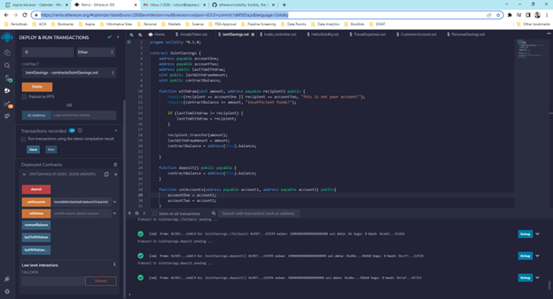
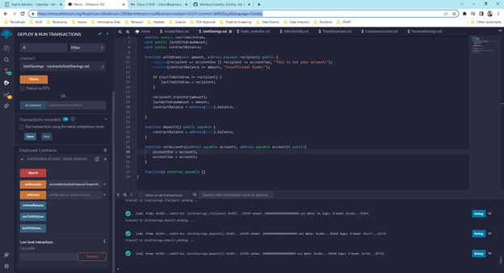
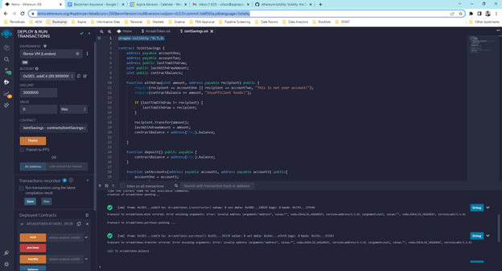

# 20-smart-contracts-to-automate-creation-of-savings-accounts

In this challenge, I assumed the role of an employee working for a company that is created its own cross-border, Ethereum-compatible blockchain that connects financial institutions. Currently, the team is building smart contracts to automate many of the institutions’ financial processes and features, such as hosting joint savings accounts.

To automate the creation of joint savings accounts, I created a Solidity smart contract that accepts two user addresses. These addresses are able to control a joint savings account. My smart contract uses ether management functions to implement a financial institution’s requirements for providing the features of a joint savings account. These features consist of the ability to deposit and withdraw funds from the account.

The repo contains:

(1) The completed Solidity `JointSavings` smart contract. See the file `joint_savings_final.sol` to review the code.

(2) Images that confirm that the deposit and withdrawal transactions, which are designed to test the `JointSavings` functionality in the Remix VM.

## IDE

Used the Remix IDE 

```python
https://remix.ethereum.org
```
---

## Technologies

* [solidity](https://github.com/ethereum/solidity) - Solidity is a statically typed, contract-oriented, high-level language for implementing smart contracts on the Ethereum platform.
---

### **Step 1: Created a Joint Savings Account Contract in Solidity**

(1) Opened a Solidity file named `joint_savings.sol` in the Remix IDE.

(2) Defined a new contract named `JointSavings`.

(3) Defined the following variables in the new contract:

(a) Two variables of type `address payable` named `accountOne` and `accountTwo`

(b) A variable of type `address public` named `lastToWithdraw`

(c) Two variables of type `uint public` named `lastWithdrawAmount` and `contractBalance`

(4) Defined a function named `withdraw` that accepts two arguments: `amount` of type `uint` and `recipient` of type `payable address`. In this function, code the following:

(a) Defined a `require` statement that checks if `recipient` is equal to either `accountOne` or `accountTwo`. If it isn’t, the `require` statement returns the “You don't own this account!” text.

(b) Defined a `require` statement that checks if `balance` is sufficient for accomplishing the withdrawal operation. If there are insufficient funds, it returns the “Insufficient funds!” text.

(c) Added an `if` statement to check if `lastToWithdraw` is not equal (`!=`) to `recipient`. If it’s not equal, set it to the current value of `recipient`.

(d) Called the `transfer` function of the `recipient`, and passed it the `amount` to transfer as an argument.

(e) Set `lastWithdrawAmount` equal to `amount`.

(f) Set the `contractBalance` variable equal to the balance of the contract by using `address(this).balance` to reflect the new balance of the contract.

(5) Defined a `public payable` function named `deposit`. In this function, code the following:

(a) Set the `contractBalance` variable equal to the balance of the contract by using `address(this).balance`.

(6) Defined a `public` function named `setAccounts` that takes two `address payable` arguments, named `account1` and `account2`. In the body of the function, set the values of `accountOne` and `accountTwo` to `account1` and `account2`, respectively.

(7) Added a fallback function so that your contract can store ether that’s sent from outside the deposit function.

### **Step 2: Compiled and Deployed Contract in the VM**

(1) Compiled a smart contract. If an error occurs, reviewed code, and made the necessary changes for a successful compilation.

* 

* 

(2) In the Remix IDE, navigated to the “Deploy & Run Transactions” pane, and then made sure that “Remix VM (London)” is selected as the environment.

* 

(3) Clicked the Deploy button to deploy your smart contract, and then confirmed that it successfully deployed.

*  
    
### **Step 3: Interacted with Deployed Smart Contract**

Tested the functionality of the smart contract. After each step, I captured a screenshot of the execution.

To interact with the deployed smart contract, I completed the following steps:

(1) Used the `setAccounts` function to define the authorized Ethereum address that will be able to withdraw funds from your contract.

* 

(2) Tested the deposit functionality of the contract by sending the following amounts of ether. After each transaction, used the contractBalance function to verify that the funds were added to the contract:

(a) Transaction 1: Send 1 ether as wei.

*  

(b) Transaction 2: Send 10 ether as wei.

*  

(c) Transaction 3: Send 5 ether.

*  
    
---
## Contributors

Brought to you by Wilson Rosa. https://www.linkedin.com/in/wilson-rosa-angeles/.

---
## License

MIT